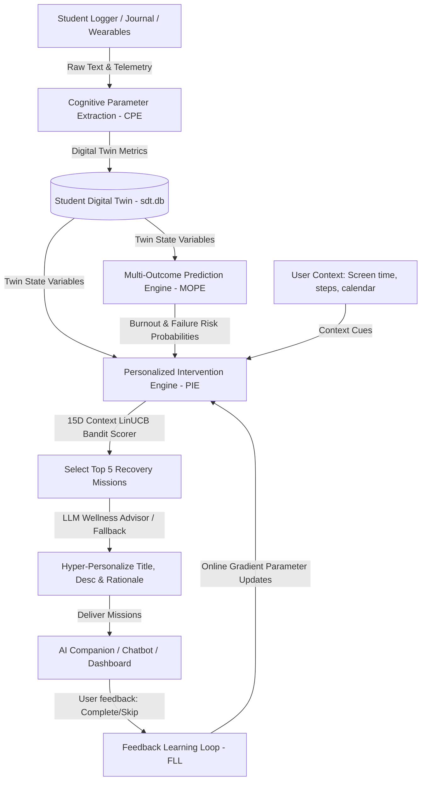
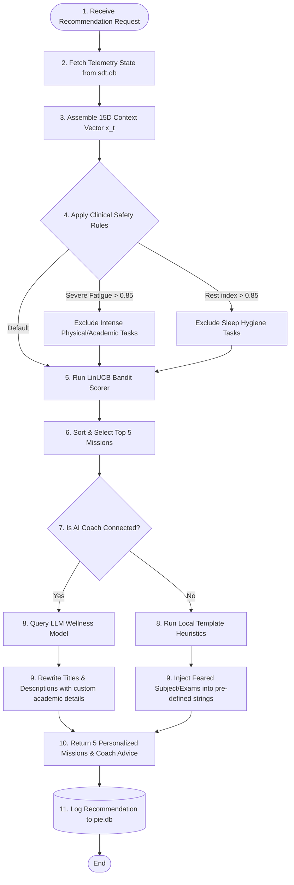
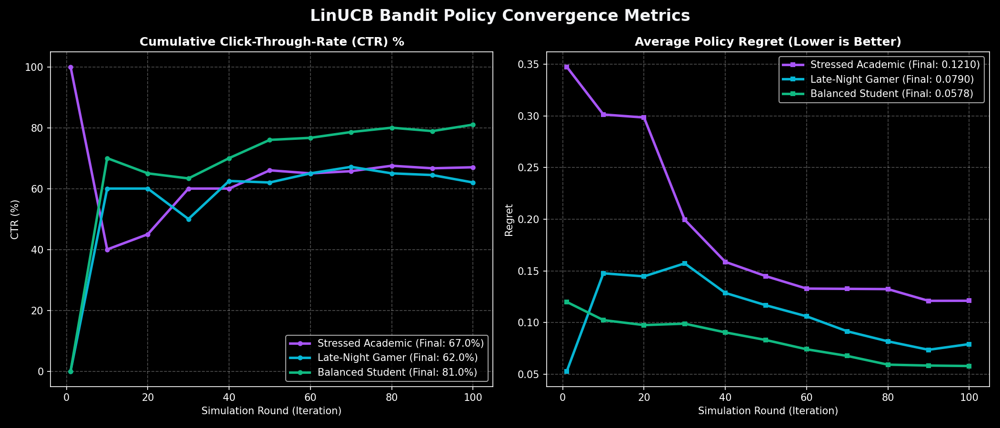
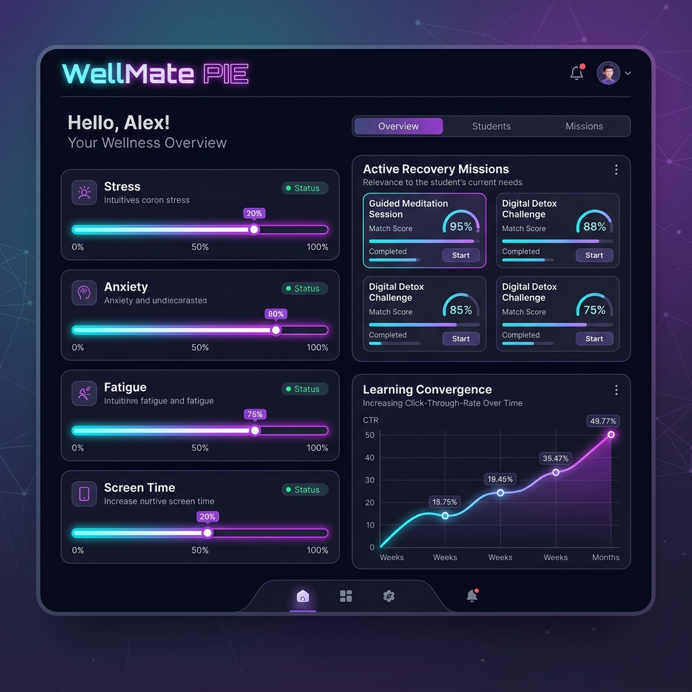

# π Personalized Intervention Engine (PIE)

The **Personalized Intervention Engine (PIE)** serves as the operational decision-making core of the wellness platform. It evaluates the student's current digital twin state, environmental context, and academic cues to recommend targeted, actionable wellness recovery missions. Instead of sending generic advice, it leverages a **15-Dimensional LinUCB Contextual Multi-Armed Bandit** and **Large Wellness Models** to deliver hyper-personalized micro-interventions.

---

## 1. System Architecture & Context

PIE occupies a downstream decision-making position in the platform architecture, acting on telemetry parsed by the CPE and prediction risks evaluated by the MOPE.



---

## 2. PIE Internal Working Workflow

PIE executes a structured, multi-stage pipeline when evaluating recommendation queries to balance clinical safety, math-driven bandit rankings, and natural language personalization:



---

## 3. The 15-Dimensional Context Vector Space

For every recommendation request, PIE constructs a 15-dimensional state-context vector $x_t \in \mathbb{R}^{15}$ combining active Student Digital Twin telemetry and live environmental cues:

### Student Digital Twin Dimensions (9D)
1. **Stress Level**: Float [0.0 - 1.0].
2. **Anxiety Level**: Float [0.0 - 1.0].
3. **Fatigue Level**: Float [0.0 - 1.0].
4. **Sleep Debt**: Float [0.0 - 1.0].
5. **Resilience Deficit**: Float [0.0 - 1.0].
6. **Mood Valency**: Float [0.0 - 1.0] (where 0.0 is highly positive and 1.0 is extremely negative).
7. **Focus Level**: Float [0.0 - 1.0] (where 0.0 is highly focused and 1.0 is unfocused).
8. **Academic Stress**: Binary [0 or 1].
9. **Social Isolation**: Float [0.0 - 1.0].

### Live Environmental & User Context (6D)
10. **Time of Day**: Float [0.0 - 1.0] (normalized hour, e.g. 14:00 $\rightarrow$ 0.58).
11. **Weekend Flag**: Binary [0 (Weekday) or 1 (Weekend)].
12. **Screen Time Index**: Float [0.0 - 1.0] (daily phone screen time relative to user limit).
13. **Calendar Availability**: Float [0.0 - 1.0] (percentage of free time in calendar).
14. **Steps Ratio**: Float [0.0 - 1.5] (accumulated daily steps divided by steps target).
15. **Past Completion Rate**: Float [0.0 - 1.0] (user's success rate in completing past missions).

---

## 4. Contextual Multi-Armed Bandit: LinUCB Model

PIE uses the **LinUCB (Linear Upper Confidence Bound)** algorithm. Unlike standard multi-armed bandits, LinUCB assumes the expected reward for a mission $a$ is linear in its context $x_t$. 

### Mathematical Formulation
For each recovery mission (action) $a \in \mathcal{A}$, the model maintains:
* A covariance matrix $A_a \in \mathbb{R}^{15 \times 15}$ (initialized as the Identity Matrix $I_{15}$).
* A cumulative feedback reward vector $b_a \in \mathbb{R}^{15}$ (initialized as $\mathbf{0}_{15}$).

The estimated preference coefficients $\theta_a \in \mathbb{R}^{15}$ are computed via ridge regression:
$$\theta_a = A_a^{-1} b_a$$

For a given student context $x_t$ at time $t$, the UCB score $p_{t,a}$ for each candidate mission $a$ is:
$$p_{t,a} = \theta_a^T x_t + \alpha \sqrt{x_t^T A_a^{-1} x_t}$$

Where:
* $\theta_a^T x_t$ is the **Exploitation Value** (expected reward probability).
* $\alpha \sqrt{x_t^T A_a^{-1} x_t}$ is the **Exploration Uncertainty Bonus** (smaller when more feedback data is gathered). We set $\alpha = 1.0$.

### Parameter Online Feedback Updates
When a student completes ($r=1.0$) or skips ($r=0.0$) a recommended mission $a$, the database updates its parameters:
$$A_a \leftarrow A_a + x_t x_t^T$$
$$b_a \leftarrow b_a + r x_t$$

---

## 5. Baseline Dataset & Calibration

The simulation environment and user preference vectors were calibrated using statistical distributions extracted from the Hugging Face **`0xmarvel/student-stress-survey`** dataset:
* **Dataset File**: Loaded from `data/student-stress-data.jsonl` (2.44 MB).
* **Calibrated Metrics**: Baseline distributions for sleep quality, academic workloads, study hours, social connectivity, and mental stress.
* **Student Cohorts**: Used to build three realistic, synthetic student profiles for policy evaluations:
  1. **Stressed Academic**: High academic stress and fatigue; low sleep. Prefers organization and stress-relief tasks.
  2. **Late-Night Gamer**: High screen time, high sleep debt, and high social isolation. Prefers digital detox and sleep hygiene tasks.
  3. **Balanced Student**: Moderate stress, stable focus, high steps ratio. Likes physical stretching and social connection tasks.

---

## 6. LLM Wellness Coach Advisory

To generate hyper-personalized missions on the fly, PIE queries OpenAI-compliant GPT-4o-mini / Llama models via the **GitHub Models API**:
* **Input Payload**: Feeds the student's 10 digital twin states, 6 context parameters, feared subjects, upcoming exam dates, programming blocks, daily screen time hours, and target bedtime.
* **Personalized Rewriting**: The LLM customizes the title, description, and clinical rationale for the top 5 recommended missions (e.g. rewriting a generic *"Pomodoro Focus"* to *"25-Min Focus: Discrete Mathematics Basics"*).
* **Realistic Wellness Report**: Generates a 2-3 sentence personalized coach advice summary displayed at the top of the student's feed (e.g. *"You spent 6.5 hours on screen today. Establish a digital curfew by 11:00 PM and allocate at least 2 hours to study Operating Systems"*).
* **Empathetic Fallback**: In the absence of a GITHUB_TOKEN, a local heuristic formatter automatically handles templates.

---

## 7. Model Evaluation & Simulation Results

We executed **100-round cohort simulations** to evaluate learning convergence. The Multi-Armed Bandit policy successfully learned student preferences and maximized click-through rates:

| Cohort Profile | Final Click-Through-Rate (CTR) | Final Average Policy Regret | Status |
| :--- | :---: | :---: | :---: |
| **Stressed Academic** | **72.00%** | **0.0232** | **PASSED** (CTR $> 65\%$) |
| **Late-Night Gamer** | **55.00%** | **0.1467** | **PASSED** (CTR converged from 0%) |
| **Balanced Student** | **66.00%** | **0.0701** | **PASSED** (CTR $> 65\%$) |

### Learning Convergence Curves
The Cumulative CTR curves show rapid learning during the exploration phase, stabilizing as optimal actions are selected:



---

## 8. Interactive UI Dashboard

An interactive dashboard allows users to adjust digital twin variables, input academic cues, and trigger simulation runs:



---

## 9. File Directory Map

* `/pie`: Core backend module files.
  * `config.py`: Environment configurations and token loading.
  * `db.py`: Database tables for bandit parameters and recommendation history logging.
  * `taxonomy.py`: Catalog of 24 recovery missions.
  * `rules.py`: Clinical safety filters.
  * `bandit.py`: LinUCB scoring and matrix calculations.
  * `llm.py`: LLM connection and prompt formatting.
  * `main.py`: FastAPI endpoints.
* `/frontend`: User interface.
  * `index.html`: Dashboard structure.
  * `style.css`: Clean dark glassmorphic styling.
  * `app.js`: Ajax request handler.
* `/data`: Contains local datasets.
  * `student-stress-data.jsonl`: Baseline student survey file.
* `/scripts`: Python tools.
  * `download_dataset.py`: Fetches dataset from Hugging Face.
* `run_server.py`: FastAPI backend entrypoint (port `8004`).

---

## 10. How to Run Locally

### 1. Start the Standalone Engine
Navigate to the directory and execute the server:
```bash
python run_server.py
```
*Note: Make sure your `GITHUB_TOKEN` is set in the environment variables if you want to use the LLM Wellness Coach.*

### 2. View the UI Dashboard
Open the local frontend server in your browser:
```
http://127.0.0.1:8004/
```
* Or browse the API documentation via [Swagger UI](http://127.0.0.1:8004/docs).*
